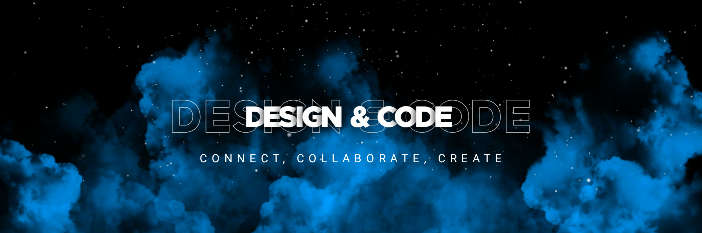

<h1 align="center">Hello 👋, I'm Tony opano</h1>
<h3 align="center">A passionate Full-stack Developer from Kenya, on the verge of solving real world problems through technical innovation, by creating and upgrading existing technologies. </h3>
<!--  -->

  
  
  
<!--    -->
  
  
  
  
  
<!--    -->
<!--    -->
<!--    -->

&nbsp;

<!--
  
 -->

<!-- 
  
 -->
